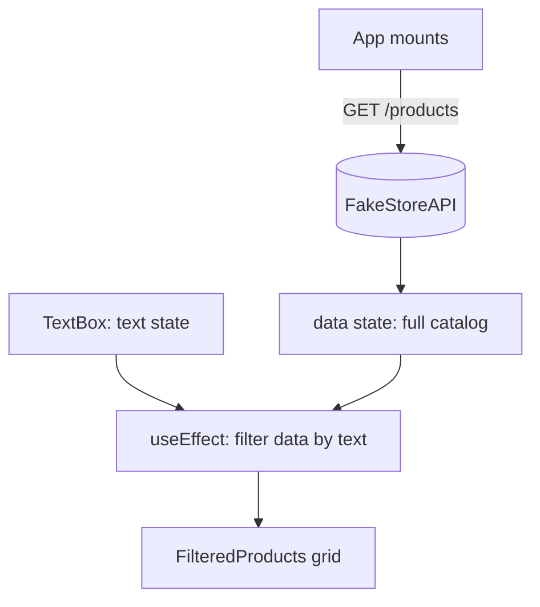

# React Native Live Product Search (REST API)


> Originally built for a university practical assessment ("Graded Lab 3"). Renamed to describe the actual system: a live, client-side search/filter over a remote product catalog rendered as a responsive grid.

## Executive Summary

Fetches a full product catalog once, then filters it client-side as the user types — a common pattern for small-to-medium datasets where a server round-trip per keystroke isn't worth the latency. Demonstrates async data fetching with loading/error states and a derived, reactive filtered view.

## Key Architectural Features

- **Fetch-once, filter-locally** — the full product list is fetched on mount; filtering by search text runs entirely client-side via `Array.filter`, avoiding a network call per keystroke.
- **Reactive filtering via `useEffect`** — a dedicated effect re-derives `filteredProducts` whenever `text` changes, keeping the filter logic declarative rather than event-driven.
- **Responsive grid layout** — `FilteredProducts` renders a two-column wrapping grid (`flexWrap`) rather than a single-column list, closer to a real storefront layout.
- **Graceful loading/error states** — `ActivityIndicator` and an error message cover the async fetch lifecycle.

## Tech Stack

| Layer | Technology |
|---|---|
| Language | JavaScript (ES6+) |
| UI Framework | React Native (Expo managed workflow) |
| Data Source | [FakeStoreAPI](https://fakestoreapi.com/) (public REST API) |
| Tooling | Expo CLI, Metro bundler |

## System / Data Flow



## Getting Started & Local Setup

**Prerequisites:** Node.js 18+, npm, [Expo Go](https://expo.dev/go) or a simulator.

1. Install dependencies:
   ```bash
   git clone https://github.com/MzooNgubane/react-native-live-product-search.git
   cd react-native-live-product-search
   npm install
   ```
2. Run the app (no environment variables needed — this project consumes a public API):
   ```bash
   npx expo start
   ```

## Testing & Validation

No automated test suite is included. To validate:

```bash
npx expo start        # confirms the bundle compiles with no syntax/import errors
```

Manual QA: launch app → confirm the full catalog loads into a two-column grid → type into the search box → confirm the grid narrows to matching titles in real time → clear the box → confirm the full catalog returns.
